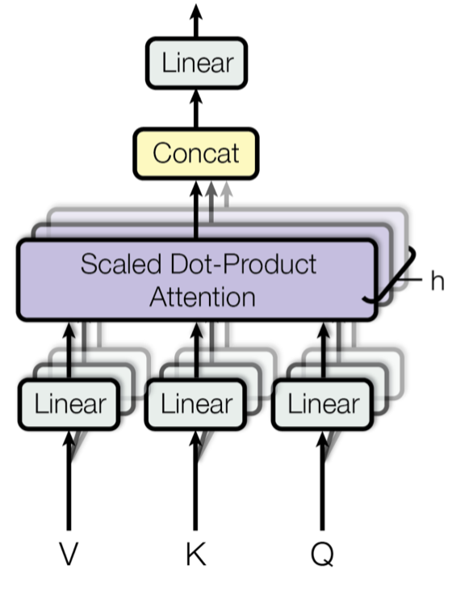
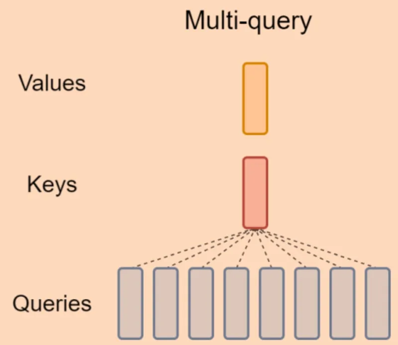
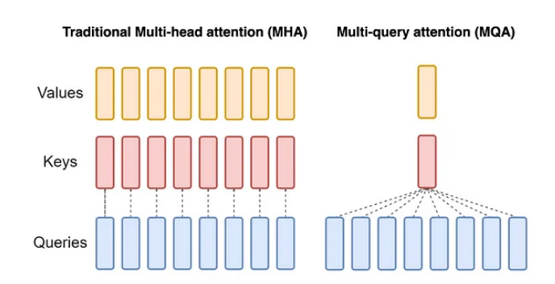

Scaled Dot Product Attention:

Link:

Paper : https://arxiv.org/abs/1706.03762

Introduced in the original transformer paper from 2017
Incorporates a scaling factor (1/√d_model) to prevent attention scores from having extreme values

Attention(Q, K, V) = softmax(QK^T/√d_k)V

Multi Head Attention:

Link: 

Paper : https://arxiv.org/abs/1706.03762

Splits Query, Key, and Value matrices into N independent attention heads
Each head processes a different projection of the input
Outputs from all heads are concatenated and linearly transformed
Enables the model to attend to information from different representation subspaces

Multi Query Attention:

Link:

Paper: https://arxiv.org/abs/1911.02150

Uses multiple query heads but single key and value heads
Significantly reduces memory requirements
Trade-off between efficiency and model capacity

Grouped Query Attention:

Link:

Paper: https://arxiv.org/abs/2305.13245

Groups queries into sets sharing the same key and value matrices
More efficient than MHA while maintaining better performance than MQA
Flexible architecture allowing for different numbers of query groups
Better balance between computational efficiency and model performance

RoPE Attention:

Link:

Paper: https://arxiv.org/abs/2104.09864

Encodes relative position information directly in the attention computation
Uses rotation matrices to encode positional information
Enables better handling of sequence position relationships
Provides theoretical advantages over traditional positional encodings

